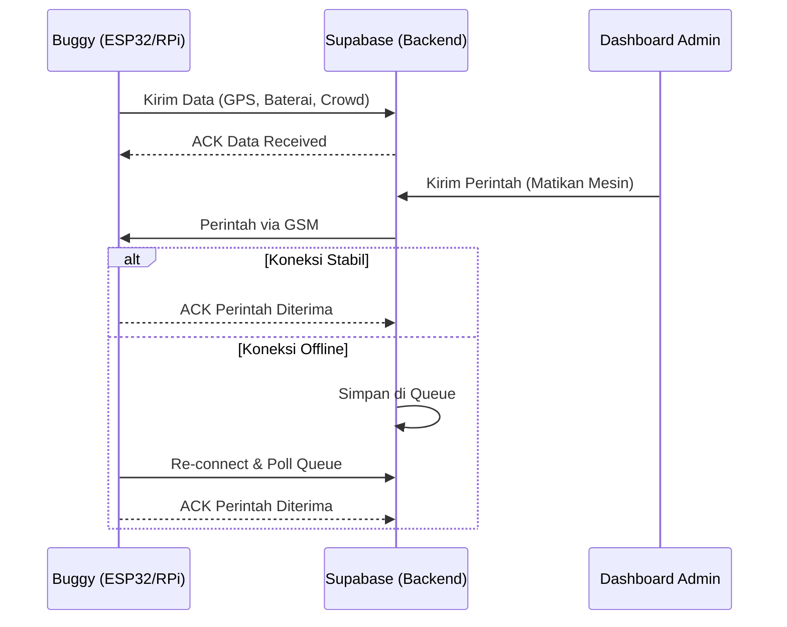
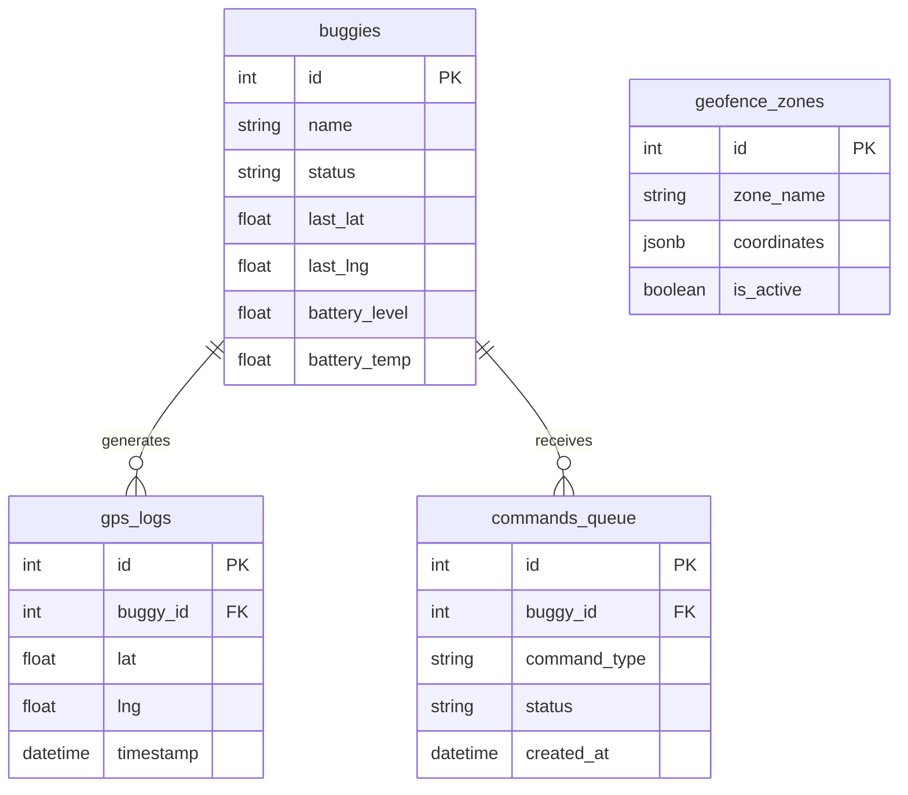

# PRD — Sistem Monitoring Buggy Listrik (Smart Mobility UNDIP)

## 1. Overview
Sistem ini dirancang untuk memonitor armada buggy listrik di lingkungan Universitas Diponegoro. Fokus utama adalah efisiensi transportasi kampus melalui pelacakan *real-time*, estimasi waktu kedatangan (ETA), pemantauan kepadatan penumpang (*crowd level*), serta keamanan armada melalui *geofencing* dan *remote engine cut-off*.

## 2. Requirements
- **Platform:** PWA (Next.js) untuk akses supir/admin, Web publik untuk pengguna.
- **Skala:** 1-5 unit buggy dengan interval pengiriman data sensor setiap 5 detik.
- **Keamanan:** Mekanisme *feedback loop* (ACK) untuk perintah *remote* dan sistem antrean (*retry mechanism*) saat kondisi *offline*.
- **Geofencing:** Area operasional dinamis yang dapat dikonfigurasi melalui dashboard admin.
- **Histori:** Log GPS disimpan dengan interval 10 detik.

## 3. Core Features
1. **Dashboard Publik:** Peta *real-time* posisi buggy, ETA ke halte, dan indikator *crowd level*.
2. **Dashboard Supir/Admin:** Monitoring kondisi baterai (tegangan/arus), suhu, jarak tempuh, dan status mesin.
3. **Manajemen Geofencing:** Admin dapat menggambar/mengubah koordinat area operasional (polygon) via dashboard.
4. **Keamanan:** Notifikasi otomatis jika buggy keluar zona, serta fitur *remote engine cut-off* dengan konfirmasi status (ACK).
5. **Retry Queue:** Sistem antrean untuk perintah yang tertunda akibat gangguan koneksi GSM.

## 4. Architecture

## 5. Database Schema

## 6. Technical Constraints & Implementation
- **Tech Stack:** Next.js (Frontend/PWA), Tailwind CSS (Styling), Supabase (Database & Auth), Google Maps API (Visualisasi).
- **Data Processing:** Raspberry Pi melakukan pengolahan citra untuk mendapatkan *crowd level* (angka), data mentah tidak disimpan di *storage* untuk efisiensi.
- **Autentikasi:** Pemisahan *middleware* autentikasi untuk akses Publik (tanpa login), Supir (login), dan Admin (login).
- **Offline Handling:** 
    - Data sensor: *Buffer* lokal pada mikrokontroler saat GSM mati.
    - Perintah Admin: *Command Queue* di Supabase dengan status `pending` hingga buggy mengirimkan ACK.

## 7. User Flow
1. **Publik:** Membuka URL web -> Memuat peta Google Maps -> Menampilkan marker buggy dengan info ETA & *crowd level*.
2. **Supir:** Login PWA -> Memantau status baterai -> Menerima notifikasi jika ada perintah dari admin.
3. **Admin:** Login PWA -> Mengatur zona *geofence* -> Memantau *dashboard* armada -> Mengirim perintah *cut-off* jika terdeteksi anomali (pencurian).