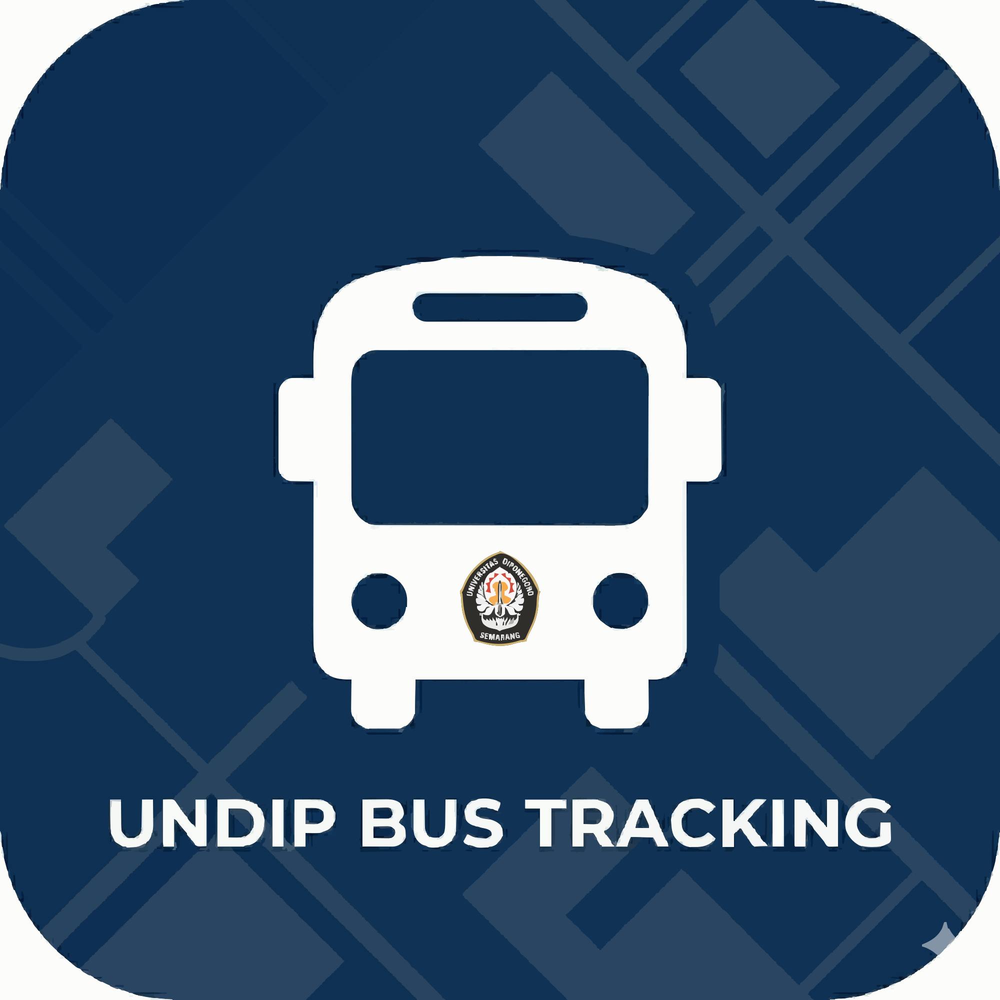
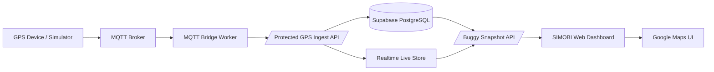

# SIMOBI - Realtime Electric Buggy Monitoring

<p align="center">
  
</p>

<h3 align="center">A smart mobility web platform for monitoring electric buggy fleets in real time.</h3>

<p align="center">
  
  
  
  
  
</p>

## About The Project

SIMOBI is a realtime monitoring system for electric buggy transportation at Universitas Diponegoro. The platform helps passengers, drivers, and campus operators track buggy positions, view route information, monitor fleet activity, and manage operational data from one responsive web application.

This project was built as a final-year thesis project and focuses on practical smart mobility implementation: GPS telemetry, MQTT-based data ingestion, Supabase persistence, Google Maps visualization, role-based dashboards, geofencing, and operational analytics.

## Preview

<p align="center">
  
</p>

## What This Web App Includes

### Realtime Passenger Dashboard

- Live electric buggy positions on Google Maps.
- Buggy markers, halte markers, route visualization, and active fleet panels.
- ETA, passenger occupancy, speed, current halte, next halte, and trip status.
- Route search from the user's location to the destination.
- Nearest halte recommendation for easier pickup planning.
- Favorite buggy and halte shortcuts.
- Responsive mobile-first navigation with a bottom drawer experience.

### Admin Operations Dashboard

- Fleet overview for campus buggy operators.
- Operational statistics for active buggies, utilization, speed, battery, distance, and trip sessions.
- Buggy data management.
- Halte data management.
- Geofence creation and monitoring.
- Geofence event logs for detecting vehicles outside operational areas.
- Browser notification controls.
- Account management for admin and driver users.
- Compact dashboard panels designed for daily operational scanning.

### Driver Dashboard

- Driver-specific access based on assigned buggy.
- Restricted operational view so drivers only see relevant fleet information.
- Realtime buggy status and route context for the active unit.

### Trip History

- Session-based buggy history.
- Recorded route paths for completed trips.
- Distance, duration, average speed, battery usage, and point count summaries.
- Admin-facing historical view for reviewing fleet movement.

### GPS Tracker And Simulator

- Built-in `/gps-tracker` testing page for publishing simulated GPS data.
- Supports single-device and multi-buggy simulation.
- MQTT WebSocket publishing for development and telemetry testing.
- Payload support for latitude, longitude, speed, heading, altitude, accuracy, battery level, passenger count, capacity, and session state.

### Internationalization

- Locale-prefixed routing with `/id` and `/en`.
- Indonesian and English interface support.
- Cookie/browser locale fallback.
- Translated metadata, navigation, dashboard, admin, settings, auth, history, and error messages.

## Core Capabilities

| Capability | Description |
| --- | --- |
| Realtime Tracking | Displays live buggy movement from backend telemetry data. |
| Smart Route UX | Helps passengers find routes, nearby haltes, and the closest buggy context. |
| Fleet Management | Allows operators to manage buggy, halte, account, notification, and geofence data. |
| Geofence Monitoring | Tracks whether a buggy remains inside configured campus operation zones. |
| Historical Analytics | Stores raw GPS history and aggregates trip sessions for admin review. |
| Role-Based Access | Separates public, driver, and admin experiences using Supabase Auth. |
| MQTT Ingestion | Accepts telemetry through an external MQTT bridge and protected ingest API. |
| PWA Push Alerts | Stores Web Push subscriptions and can notify users when an active buggy approaches the halte nearest to their last known browser position. |
| Bilingual UI | Supports Indonesian and English user experiences. |

## System Architecture



SIMOBI keeps MQTT outside the browser-facing app. Telemetry is normalized by a bridge worker, validated by the backend, stored in Supabase, then exposed to the dashboard through API routes. This keeps the frontend clean while allowing the hardware/simulator layer to evolve independently.

## Realtime Data Flow

1. A GPS device publishes telemetry with a physical `deviceId`, for example `ESP-1A2B3C4D`.
2. The MQTT bridge normalizes it to `devicesId` and forwards it to the protected `/api/gps-beacon` ingest API.
3. The backend looks up the active `device_assignments` row to resolve `devicesId -> buggy_id`.
4. The resolved buggy is updated in the live store, `latest_buggy_telemetry`, and `buggy_history`.
5. The dashboard reads the latest buggy snapshot from the backend.
6. Admin history panels read aggregated sessions from Supabase.

Legacy telemetry with `buggyId` is still accepted for compatibility, but new ESP firmware should keep sending `deviceId`. Device-to-buggy mapping is changed from the admin dashboard, so an ESP can move from Buggy 01 to Buggy 02 without reflashing.

## Data Model

| Data Area | Purpose |
| --- | --- |
| `accounts` | User profile, role, and driver assignment. |
| `buggies` | Fleet master data, capacity, code, and active status. |
| `device_assignments` | Active mapping from physical ESP `devices_id` to a buggy record. |
| `haltes` | Campus halte points, order, schedule, and facilities. |
| `geofences` | Operational areas used for geofence monitoring. |
| `announcements` | Admin-managed public notifications. |
| `buggy_history` | Raw GPS telemetry records. |
| `buggy_session_history` | Aggregated trip/session history. |
| `notification_subscriptions` | Web Push endpoints, last known user location, alert radius, and push cooldown state. |

## PWA Web Push Setup

SIMOBI includes a service worker at `/sw.js`, public subscribe/unsubscribe APIs, and a protected `/api/push/check-nearby` worker endpoint. The endpoint checks active buggy positions against each subscriber's nearest halte and sends Web Push notifications with cooldown protection.

Required environment variables:

```bash
NEXT_PUBLIC_WEB_PUSH_VAPID_PUBLIC_KEY=...
WEB_PUSH_VAPID_PRIVATE_KEY=...
WEB_PUSH_VAPID_SUBJECT=mailto:admin@example.com
PUSH_WORKER_TOKEN=...
```

Generate VAPID keys locally with:

```bash
npx web-push generate-vapid-keys
```

Run the checker from Vercel Cron or another scheduler:

```bash
curl -X POST https://your-domain.example/api/push/check-nearby \
  -H "Authorization: Bearer $PUSH_WORKER_TOKEN"
```

For Vercel Cron, set `CRON_SECRET` instead of or in addition to `PUSH_WORKER_TOKEN`, and schedule `/api/push/check-nearby`. Browser PWAs cannot reliably read fresh background location while closed, so the server uses the last user position synced by the active web app

## Main App Areas

| Area | What It Shows |
| --- | --- |
| Public Map | Live fleet map, route search, halte details, buggy detail, nearby halte chips. |
| Admin | Statistics, fleet data, geofence manager, history, notifications, account settings. |
| Driver | Assigned buggy monitoring and limited operational context. |
| GPS Tracker | MQTT simulator for testing telemetry and session recording. |
| Login/Auth | Email auth, Google auth, registration, reset password, and role routing. |
| Settings | Language switch, map preferences, notification settings, and account management. |

## Technical Highlights

- Built with Next.js App Router and React Server/Client component boundaries.
- Uses Supabase Auth for session handling and role-aware routing.
- Protects admin APIs with server-side role checks.
- Protects telemetry ingest endpoints using a required bearer token.
- Uses a standalone MQTT bridge worker so realtime ingestion is not tied to Vercel serverless runtime.
- Persists GPS history to PostgreSQL while keeping a fast live snapshot for map rendering.
- Supports polling by default with an optional SSE stream route.
- Uses Google Maps JavaScript API for map rendering, markers, route paths, and halte context.
- Uses i18next for locale-aware routing and translated dashboard copy.
- Designed with compact glass-style UI panels for operational dashboards.

## Tech Stack

| Layer | Technology |
| --- | --- |
| Web Framework | Next.js 16 App Router |
| UI Runtime | React 19 |
| Language | TypeScript |
| Styling | Tailwind CSS 4 |
| Authentication | Supabase Auth |
| Database | Supabase PostgreSQL |
| Realtime Transport | MQTT + protected Next.js ingest API |
| Maps | Google Maps JavaScript API |
| Localization | i18next, react-i18next |
| Icons/UI | lucide-react, custom UI components |
| Deployment Model | Vercel web app + separate MQTT bridge worker |

## Project Value

SIMOBI demonstrates how a campus transportation system can combine web technology and IoT-style telemetry into a practical monitoring dashboard. The project is not only a map interface, but also a complete operational surface with authentication, fleet management, geofence awareness, telemetry history, driver-specific access, and bilingual user experience.

## Current Status

SIMOBI currently supports realtime monitoring, admin operations, driver views, geofence management, trip history, bilingual routing, and MQTT-based telemetry ingestion through a separate bridge worker. Future improvements can focus on final hardware integration, command queues, field testing, and production-grade alert workflows.

## Author

Developed as a final-year thesis project for Smart Mobility at Universitas Diponegoro.
