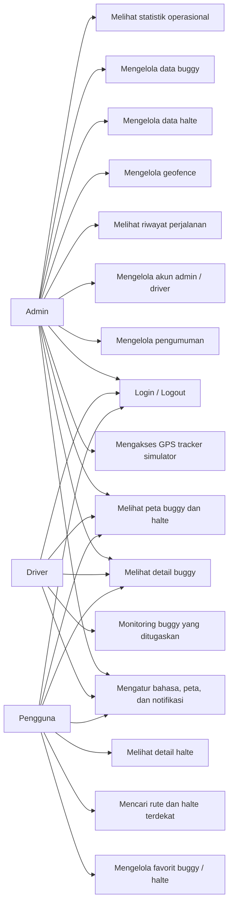
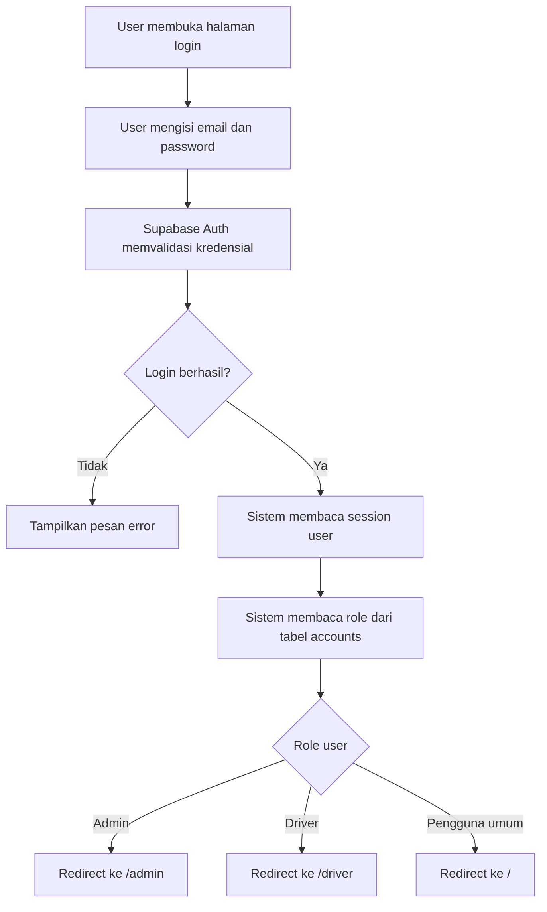
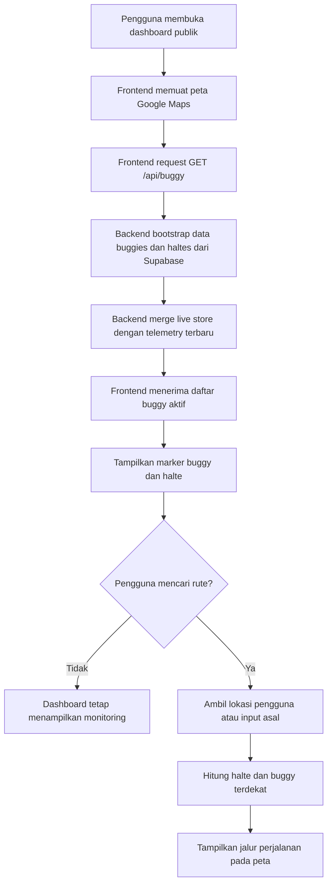
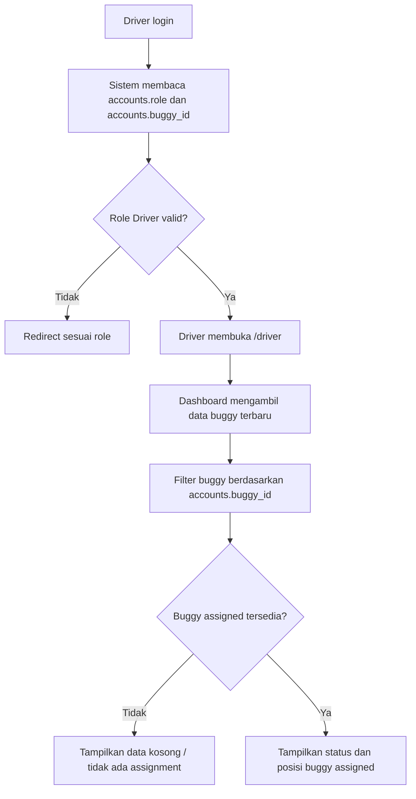
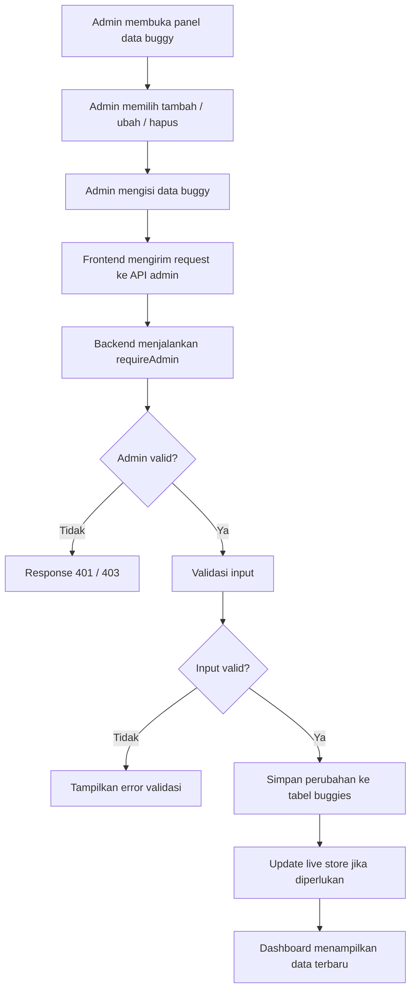
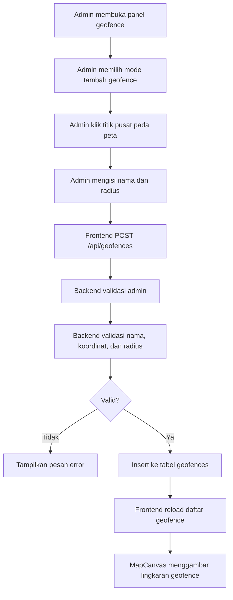
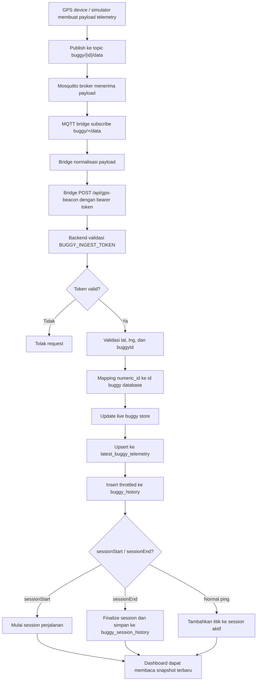
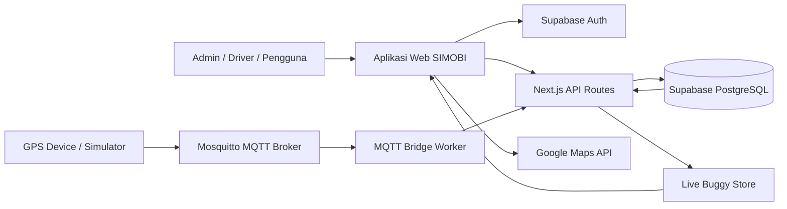
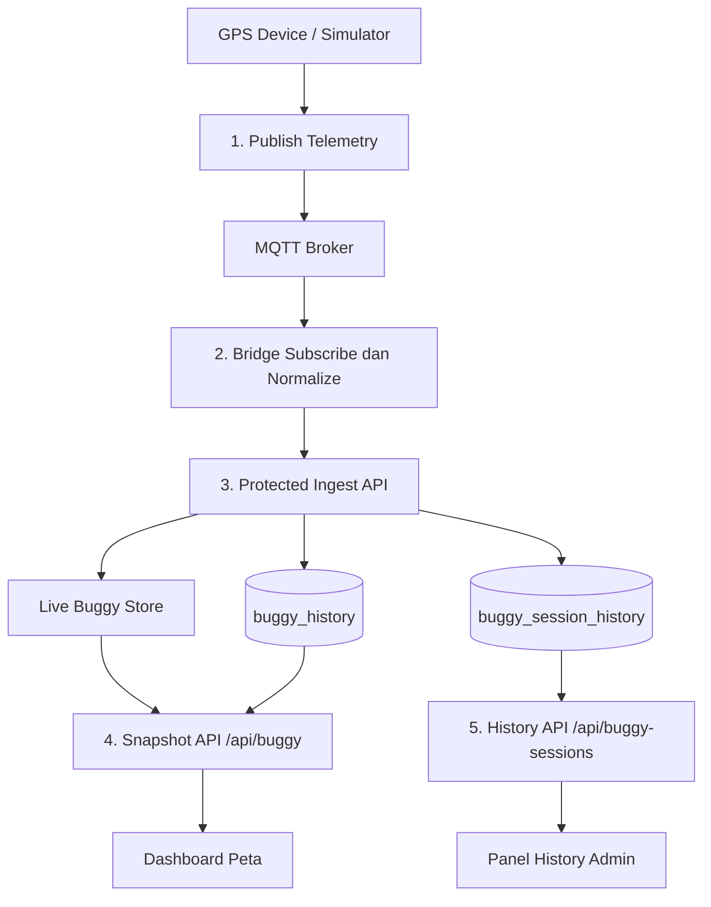
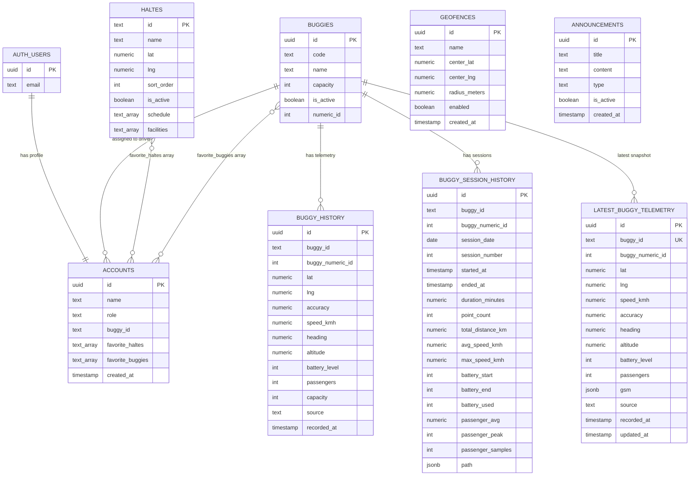

# Dokumentasi Use Case, Activity Diagram, Alur Data, dan Database SIMOBI

> Dokumen ini dibuat untuk kebutuhan penulisan skripsi berdasarkan struktur repo SIMOBI saat ini.
> Role sistem disederhanakan menjadi 3: `Admin`, `Driver`, dan `Pengguna`.
> Pada implementasi database, role pengguna umum disimpan sebagai `Pengguna umum`.

---

## 1. Ringkasan Sistem

SIMOBI adalah aplikasi web monitoring armada buggy listrik kampus. Sistem menampilkan posisi buggy secara real-time pada Google Maps, menyediakan informasi halte dan rute, serta menyediakan dashboard operasional untuk admin dan driver.

Secara umum, sistem terdiri dari:

- Aplikasi web berbasis Next.js.
- Autentikasi dan role management menggunakan Supabase Auth dan tabel `accounts`.
- Database utama menggunakan Supabase PostgreSQL.
- Data GPS masuk melalui Mosquitto MQTT Broker dan MQTT Bridge.
- Backend menerima telemetry melalui endpoint protected `/api/gps-beacon`.
- Frontend mengambil snapshot buggy terbaru melalui `/api/buggy`.
- Peta dan route visualization menggunakan Google Maps JavaScript API.

Alur utama:

```text
GPS Device / Simulator
  -> Mosquitto MQTT Broker
  -> MQTT Bridge Worker
  -> POST /api/gps-beacon
  -> Live Buggy Store + Supabase PostgreSQL
  -> GET /api/buggy
  -> Dashboard SIMOBI
  -> Google Maps UI
```

---

## 2. Role Sistem

| Role | Label Implementasi | Deskripsi |
| --- | --- | --- |
| Admin | `Admin` | Pengelola operasional sistem, armada, halte, geofence, akun, notifikasi, statistik, dan riwayat perjalanan. |
| Driver | `Driver` | Pengemudi buggy yang memiliki akses terbatas berdasarkan buggy yang ditugaskan. |
| Pengguna | `Pengguna umum` | Pengguna umum atau penumpang yang melihat peta, buggy aktif, halte, rute, dan informasi perjalanan. |

---

## 3. Fitur per Role

### 3.1 Admin

Fitur utama Admin:

- Login dan diarahkan ke halaman `/admin`.
- Melihat dashboard peta dan status seluruh buggy.
- Melihat statistik operasional bulanan.
- Melihat jumlah trip, jarak tempuh, durasi, kecepatan rata-rata, dan top buggy.
- Mengelola data buggy.
- Menambah buggy baru.
- Mengubah atau menghapus data buggy.
- Mengelola data halte.
- Menambah, mengubah, menghapus, dan mengaktifkan/nonaktifkan halte.
- Mengelola geofence berbasis titik pusat dan radius.
- Menambah geofence.
- Mengaktifkan atau menonaktifkan geofence.
- Menghapus geofence.
- Melihat log event geofence pada dashboard.
- Melihat riwayat perjalanan buggy.
- Melihat detail session perjalanan dan path perjalanan.
- Menghapus riwayat session jika diperlukan.
- Mengelola akun admin dan driver.
- Membuat akun baru.
- Mengubah role akun.
- Menghubungkan akun driver ke buggy tertentu.
- Menghapus akun.
- Mengelola pengumuman/notifikasi.
- Mengakses halaman `/gps-tracker` untuk testing telemetry.
- Mengatur preferensi aplikasi, bahasa, style peta, dan notifikasi browser.

### 3.2 Driver

Fitur utama Driver:

- Login dan diarahkan ke halaman `/driver`.
- Melihat dashboard terbatas.
- Melihat hanya buggy yang ditugaskan melalui kolom `accounts.buggy_id`.
- Melihat posisi buggy yang ditugaskan.
- Melihat status operasional buggy, seperti aktif/nonaktif, kecepatan, kapasitas, jumlah penumpang, dan halte/rute.
- Melihat konteks perjalanan dan monitoring unit yang relevan.
- Menggunakan pengaturan umum seperti bahasa, style peta, dan notifikasi browser.

Batasan Driver:

- Tidak dapat mengelola akun.
- Tidak dapat menambah atau menghapus buggy.
- Tidak dapat mengubah data master halte.
- Tidak dapat mengelola geofence.
- Tidak dapat mengakses `/gps-tracker`.
- Tidak memiliki akses penuh seperti Admin.

### 3.3 Pengguna

Fitur utama Pengguna:

- Melihat dashboard publik pada halaman utama.
- Melihat posisi buggy aktif pada Google Maps.
- Melihat marker halte.
- Melihat daftar buggy aktif.
- Melihat detail buggy, termasuk ETA, kecepatan, kapasitas, jumlah penumpang, halte saat ini, dan halte berikutnya.
- Melihat detail halte.
- Mencari rute dari lokasi asal ke tujuan.
- Mendapat rekomendasi halte terdekat.
- Melihat pengumuman aktif.
- Mengatur bahasa dan tampilan peta.
- Mengaktifkan notifikasi browser ketika buggy mendekati halte.
- Jika sudah login, dapat menyimpan halte dan buggy favorit.

Batasan Pengguna:

- Tidak dapat membuka halaman `/admin`.
- Tidak dapat membuka halaman `/driver`.
- Tidak dapat mengakses API admin.
- Tidak dapat mengubah data master.
- Tidak dapat mengakses riwayat operasional admin.

---

## 4. Use Case Diagram

Diagram berikut memakai Mermaid `flowchart` agar dapat langsung dirender di Markdown.



---

## 5. Daftar Use Case

### UC-01 Login dan Role Routing

| Elemen | Keterangan |
| --- | --- |
| Aktor | Admin, Driver, Pengguna |
| Tujuan | Mengautentikasi user dan mengarahkan ke halaman sesuai role. |
| Prasyarat | User memiliki akun di Supabase Auth dan profil pada tabel `accounts`. |
| Alur utama | User membuka login, mengisi kredensial, Supabase memvalidasi session, sistem membaca `accounts.role`, lalu mengarahkan user sesuai role. |
| Hasil | Admin diarahkan ke `/admin`, Driver ke `/driver`, Pengguna ke `/`. |
| Endpoint/Komponen | Supabase Auth, `proxy.ts`, `accounts`, `/login`. |

### UC-02 Melihat Peta dan Posisi Buggy

| Elemen | Keterangan |
| --- | --- |
| Aktor | Admin, Driver, Pengguna |
| Tujuan | Melihat posisi buggy aktif dan halte pada peta. |
| Prasyarat | Data buggy dan halte tersedia. |
| Alur utama | Frontend memanggil `/api/buggy`, backend mengambil snapshot live store dan telemetry terbaru, frontend menampilkan marker pada Google Maps. |
| Hasil | Posisi buggy dan halte terlihat pada dashboard. |
| Endpoint/Komponen | `/api/buggy`, `MapCanvas`, `useBuggyLiveFeed`, `haltes`, `buggies`, `buggy_history`. |

### UC-03 Mencari Rute dan Halte Terdekat

| Elemen | Keterangan |
| --- | --- |
| Aktor | Pengguna |
| Tujuan | Membantu pengguna menemukan rute menuju tujuan melalui halte dan buggy terdekat. |
| Prasyarat | Pengguna mengizinkan lokasi atau mengisi titik asal/tujuan. |
| Alur utama | Pengguna mengisi pencarian rute, sistem membaca posisi pengguna, menghitung halte terdekat, mencari buggy yang relevan, lalu menampilkan jalur pada peta. |
| Hasil | Pengguna melihat rekomendasi perjalanan dan halte terdekat. |
| Endpoint/Komponen | `LiveSearchBar`, `useDirectionSearch`, `useNearestHaltes`, `MapCanvas`. |

### UC-04 Mengelola Data Buggy

| Elemen | Keterangan |
| --- | --- |
| Aktor | Admin |
| Tujuan | Menambah, mengubah, atau menghapus data armada buggy. |
| Prasyarat | Admin sudah login. |
| Alur utama | Admin membuka panel data buggy, mengisi form, sistem validasi input, lalu menyimpan perubahan ke tabel `buggies`. |
| Hasil | Data buggy diperbarui dan live store ikut disinkronkan. |
| Endpoint/Komponen | `/api/admin/buggies`, `/api/admin/buggies/[id]`, `buggies`, `AdminBuggyFormPanel`. |

### UC-05 Mengelola Data Halte

| Elemen | Keterangan |
| --- | --- |
| Aktor | Admin |
| Tujuan | Mengelola halte kampus yang ditampilkan pada dashboard dan peta. |
| Prasyarat | Admin sudah login. |
| Alur utama | Admin menambah/mengubah/menghapus halte, backend menyimpan ke tabel `haltes`, lalu runtime halte diperbarui. |
| Hasil | Halte terbaru tampil pada dashboard. |
| Endpoint/Komponen | `/api/haltes`, `/api/haltes/[id]`, `haltes`, `AdminHalteFormPanel`. |

### UC-06 Mengelola Geofence

| Elemen | Keterangan |
| --- | --- |
| Aktor | Admin |
| Tujuan | Membuat area operasional buggy berbasis radius. |
| Prasyarat | Admin sudah login. |
| Alur utama | Admin mengaktifkan mode geofence, memilih titik pada peta, mengisi nama dan radius, lalu sistem menyimpan ke tabel `geofences`. |
| Hasil | Area geofence tampil sebagai lingkaran pada peta dan dapat dipakai untuk monitoring area operasional. |
| Endpoint/Komponen | `/api/geofences`, `/api/geofences/[id]`, `geofences`, `GeofenceManager`, `MapCanvas`. |

### UC-07 Melihat Riwayat Perjalanan

| Elemen | Keterangan |
| --- | --- |
| Aktor | Admin |
| Tujuan | Melihat session perjalanan buggy yang sudah selesai atau sedang berlangsung. |
| Prasyarat | Data telemetry sudah masuk ke sistem. |
| Alur utama | Admin membuka panel history, backend membaca `buggy_session_history`, melakukan sintesis dari `buggy_history` jika ada session aktif, lalu mengirim daftar session. |
| Hasil | Admin melihat durasi, jarak, rata-rata kecepatan, baterai, dan path perjalanan. |
| Endpoint/Komponen | `/api/buggy-sessions`, `/api/buggy-history`, `buggy_history`, `buggy_session_history`, `HistoryPanel`. |

### UC-08 Mengelola Akun dan Assignment Driver

| Elemen | Keterangan |
| --- | --- |
| Aktor | Admin |
| Tujuan | Membuat dan mengatur akun admin/driver serta assignment driver ke buggy. |
| Prasyarat | Admin sudah login dan service role Supabase tersedia. |
| Alur utama | Admin membuat akun, sistem membuat user pada Supabase Auth, trigger/logic membuat profil di `accounts`, admin mengatur role dan `buggy_id`. |
| Hasil | Akun dapat login sesuai role, driver hanya melihat buggy yang ditugaskan. |
| Endpoint/Komponen | `/api/admin/accounts`, Supabase Auth Admin API, `accounts`, `AccountManagementPanel`. |

### UC-09 Ingest Data GPS

| Elemen | Keterangan |
| --- | --- |
| Aktor | GPS Device / Simulator, MQTT Bridge |
| Tujuan | Mengirim data posisi buggy ke sistem. |
| Prasyarat | Device publish ke MQTT, bridge aktif, token ingest valid. |
| Alur utama | Device publish ke `buggy/{id}/data`, bridge subscribe `buggy/+/data`, bridge forward ke `/api/gps-beacon`, backend validasi token dan payload, lalu update live store dan insert ke database. |
| Hasil | Posisi buggy terbaru muncul pada dashboard dan history tersimpan. |
| Endpoint/Komponen | Mosquitto, MQTT Bridge, `/api/gps-beacon`, `buggy_history`, `buggy_session_history`. |

---

## 6. Activity Diagram

### 6.1 Activity Login dan Role Routing



### 6.2 Activity Dashboard Pengguna



### 6.3 Activity Monitoring Driver



### 6.4 Activity Admin Mengelola Buggy



### 6.5 Activity Admin Mengelola Geofence



### 6.6 Activity Ingest Data GPS Realtime



---

## 7. Alur Data Sistem

### 7.1 Alur Data Realtime GPS

| Tahap | Proses | Data yang Diproses |
| --- | --- | --- |
| 1 | Device/simulator membaca posisi GPS | `buggyId`, `lat`, `lng`, `speedKmh`, `heading`, `accuracy`, `batteryLevel`, `passengers`, `capacity`, `timestamp` |
| 2 | Device publish ke MQTT | Topic `buggy/{id}/data` |
| 3 | Mosquitto menerima data | Payload telemetry |
| 4 | MQTT Bridge membaca topic | Subscribe `buggy/+/data` |
| 5 | Bridge forward ke backend | `POST /api/gps-beacon` |
| 6 | Backend validasi token | Header `Authorization: Bearer <BUGGY_INGEST_TOKEN>` |
| 7 | Backend mapping ID | `buggies.numeric_id` -> `buggies.id` |
| 8 | Backend update live store | Snapshot buggy terbaru |
| 9 | Backend simpan history | Tabel `buggy_history` |
| 10 | Backend simpan session | Tabel `buggy_session_history` saat session selesai |
| 11 | Frontend mengambil data | `GET /api/buggy` |
| 12 | UI menampilkan data | Google Maps, panel buggy, statistik, history |

### 7.2 Data Flow Diagram Level 0



### 7.3 Data Flow Diagram Level 1 - Monitoring Buggy



---

## 8. Skema Database

Database utama yang digunakan adalah Supabase PostgreSQL. Skema berikut ditulis berdasarkan field yang digunakan oleh kode aplikasi.

### 8.1 Tabel `accounts`

Menyimpan profil user, role, assignment driver, dan data favorit.

| Kolom | Tipe Konseptual | Keterangan |
| --- | --- | --- |
| `id` | UUID | Primary key, terhubung dengan `auth.users.id`. |
| `name` | Text | Nama user. |
| `role` | Text / Enum | `Admin`, `Driver`, atau `Pengguna umum`. |
| `buggy_id` | Text nullable | ID/kode/numeric ID buggy yang ditugaskan ke driver. |
| `favorite_haltes` | Text array nullable | Daftar ID halte favorit user. |
| `favorite_buggies` | Text array nullable | Daftar ID buggy favorit user. |
| `created_at` | Timestamp nullable | Waktu pembuatan profil. |

Catatan:

- `buggy_id` digunakan untuk membatasi dashboard Driver.
- Nilai assignment driver dapat dicocokkan ke `buggies.id`, `buggies.code`, `buggies.name`, `buggies.numeric_id`, atau format seperti `buggy-1`.
- `favorite_haltes` dan `favorite_buggies` digunakan oleh fitur favorit pengguna login.

### 8.2 Tabel `buggies`

Menyimpan master data armada buggy.

| Kolom | Tipe Konseptual | Keterangan |
| --- | --- | --- |
| `id` | UUID | Primary key buggy. |
| `code` | Text | Kode buggy, misalnya BGY-01. |
| `name` | Text | Nama buggy. |
| `capacity` | Integer | Kapasitas penumpang. |
| `is_active` | Boolean | Status aktif master data. |
| `numeric_id` | Integer nullable | ID numerik untuk mapping payload GPS/MQTT. |

Catatan:

- `numeric_id` penting karena device biasanya mengirim ID numerik seperti `1`, sedangkan aplikasi memakai `id` dari database.

### 8.3 Tabel `haltes`

Menyimpan data halte kampus.

| Kolom | Tipe Konseptual | Keterangan |
| --- | --- | --- |
| `id` | Text / UUID | Primary key halte. |
| `name` | Text | Nama halte. |
| `lat` | Numeric | Latitude halte. |
| `lng` | Numeric | Longitude halte. |
| `sort_order` | Integer | Urutan halte pada rute. |
| `is_active` | Boolean | Status aktif halte. |
| `schedule` | Text array nullable | Jadwal keberangkatan. |
| `facilities` | Text array nullable | Fasilitas di sekitar halte. |

### 8.4 Tabel `geofences`

Menyimpan area operasional berbasis titik pusat dan radius.

| Kolom | Tipe Konseptual | Keterangan |
| --- | --- | --- |
| `id` | UUID | Primary key geofence. |
| `name` | Text | Nama geofence. |
| `center_lat` | Numeric | Latitude titik pusat. |
| `center_lng` | Numeric | Longitude titik pusat. |
| `radius_meters` | Numeric | Radius area dalam meter. |
| `enabled` | Boolean | Status aktif geofence. |
| `created_at` | Timestamp | Waktu pembuatan geofence. |

### 8.5 Tabel `announcements`

Menyimpan pengumuman yang dikelola admin dan ditampilkan pada dashboard.

| Kolom | Tipe Konseptual | Keterangan |
| --- | --- | --- |
| `id` | UUID | Primary key pengumuman. |
| `title` | Text | Judul pengumuman. |
| `content` | Text | Isi pengumuman. |
| `type` | Text | Jenis pengumuman: `info`, `warning`, atau `alert`. |
| `is_active` | Boolean | Status tampil/tidak tampil. |
| `created_at` | Timestamp | Waktu pembuatan. |

### 8.6 Tabel `buggy_history`

Menyimpan telemetry GPS mentah. Insert ke tabel ini dibatasi maksimal sekali setiap 10 detik per buggy agar database tidak terlalu berat.

| Kolom | Tipe Konseptual | Keterangan |
| --- | --- | --- |
| `id` | UUID / Bigint | Primary key history. |
| `buggy_id` | Text | ID buggy aplikasi atau format normalisasi seperti `buggy-{numericId}`. |
| `buggy_numeric_id` | Integer nullable | ID numerik dari device. |
| `lat` | Numeric | Latitude. |
| `lng` | Numeric | Longitude. |
| `accuracy` | Numeric nullable | Akurasi GPS. |
| `speed_kmh` | Numeric nullable | Kecepatan dalam km/jam. |
| `heading` | Numeric nullable | Arah pergerakan. |
| `altitude` | Numeric nullable | Ketinggian. |
| `battery_level` | Integer nullable | Level baterai 0-100. |
| `passengers` | Integer nullable | Jumlah penumpang saat data direkam. |
| `capacity` | Integer nullable | Kapasitas saat telemetry dikirim. |
| `source` | Text | Sumber data, misalnya `gps_beacon`. |
| `recorded_at` | Timestamp | Waktu data direkam. |

Catatan: kolom `passengers` ditambahkan melalui migrasi `20260526062537_add_passengers_to_buggy_history.sql`.

### 8.7 Tabel `buggy_session_history`

Menyimpan ringkasan session perjalanan.

| Kolom | Tipe Konseptual | Keterangan |
| --- | --- | --- |
| `id` | UUID | Primary key session. |
| `buggy_id` | Text | ID buggy aplikasi atau format normalisasi yang dipakai session. |
| `buggy_numeric_id` | Integer nullable | ID numerik device. |
| `session_date` | Date | Tanggal session. |
| `session_number` | Integer | Nomor session buggy pada tanggal tersebut. |
| `started_at` | Timestamp | Waktu mulai. |
| `ended_at` | Timestamp | Waktu selesai. |
| `duration_minutes` | Numeric | Durasi perjalanan. |
| `point_count` | Integer | Jumlah titik GPS dalam session. |
| `total_distance_km` | Numeric | Total jarak tempuh. |
| `avg_speed_kmh` | Numeric nullable | Kecepatan rata-rata. |
| `max_speed_kmh` | Numeric nullable | Kecepatan maksimum. |
| `battery_start` | Integer nullable | Baterai awal. |
| `battery_end` | Integer nullable | Baterai akhir. |
| `battery_used` | Integer nullable | Estimasi baterai terpakai. |
| `passenger_avg` | Numeric nullable | Rata-rata penumpang selama session. |
| `passenger_peak` | Integer nullable | Puncak penumpang tertinggi selama session. |
| `passenger_samples` | Integer nullable | Jumlah sampel pembacaan penumpang. |
| `path` | JSON / JSONB | Daftar titik perjalanan `[lat, lng, timestamp]`. |

Catatan: kolom `passenger_avg`, `passenger_peak`, dan `passenger_samples` ditambahkan melalui migrasi `20260526061902_add_passenger_metrics_to_buggy_sessions.sql`.

### 8.8 Tabel `latest_buggy_telemetry`

Menyimpan snapshot telemetry terbaru per buggy. Tabel ini dibuat untuk mendukung fallback pada `GET /api/buggy` agar data posisi terbaru tetap tersedia meskipun live store in-memory direset saat serverless cold start.

| Kolom | Tipe Konseptual | Keterangan |
| --- | --- | --- |
| `id` | UUID | Primary key. |
| `buggy_id` | Text (unique) | ID buggy aplikasi, unique per buggy. |
| `buggy_numeric_id` | Integer nullable | ID numerik dari device. |
| `lat` | Numeric | Latitude terbaru. |
| `lng` | Numeric | Longitude terbaru. |
| `speed_kmh` | Numeric nullable | Kecepatan terbaru. |
| `accuracy` | Numeric nullable | Akurasi GPS terbaru. |
| `heading` | Numeric nullable | Arah pergerakan terbaru. |
| `altitude` | Numeric nullable | Ketinggian terbaru. |
| `battery_level` | Integer nullable | Level baterai 0-100. |
| `passengers` | Integer nullable | Jumlah penumpang terbaru. |
| `gsm` | JSONB nullable | Status modul GSM (APN, sinyal, MQTT state, dsb). |
| `source` | Text | Sumber data, default `gps_beacon`. |
| `recorded_at` | Timestamp | Waktu data perangkat direkam. |
| `updated_at` | Timestamp | Waktu baris terakhir diperbarui di database. |

Catatan: tabel ini dibuat melalui migrasi `20260526054636_create_latest_buggy_telemetry.sql`. RLS diaktifkan. Setiap kali data baru masuk melalui `/api/gps-beacon`, baris buggy yang sesuai di-upsert.

---

## 9. Relasi Database

### 9.1 Relasi Utama

| Relasi | Jenis | Keterangan |
| --- | --- | --- |
| `auth.users.id` -> `accounts.id` | 1 ke 1 | Setiap user Auth memiliki satu profil akun. |
| `buggies.id/code/numeric_id` -> `accounts.buggy_id` | 1 ke banyak konseptual | Satu buggy dapat ditugaskan ke satu atau lebih akun driver. Kode aplikasi mencocokkan beberapa format ID. |
| `buggies.id/numeric_id` -> `buggy_history.buggy_id` | 1 ke banyak konseptual | Satu buggy memiliki banyak data telemetry. Nilai history dapat memakai format normalisasi. |
| `buggies.id/numeric_id` -> `buggy_session_history.buggy_id` | 1 ke banyak konseptual | Satu buggy memiliki banyak session perjalanan. |
| `haltes.id` -> `accounts.favorite_haltes[]` | Konseptual | User dapat menyimpan banyak halte favorit. |
| `buggies.id` -> `accounts.favorite_buggies[]` | Konseptual | User dapat menyimpan banyak buggy favorit. |

Catatan:

- `favorite_haltes` dan `favorite_buggies` berbentuk array ID, bukan tabel relasi many-to-many eksplisit.
- `geofences` berdiri sendiri sebagai master area operasional.
- `announcements` berdiri sendiri sebagai data pengumuman aktif/nonaktif.
- Beberapa relasi di atas bersifat konseptual karena implementasi mendukung format ID fleksibel, bukan selalu foreign key UUID ketat.
- `buggy_history.buggy_id` pada endpoint GPS dapat berisi format `buggy-{numericId}`. Pastikan tipe final di Supabase konsisten dengan nilai yang disimpan aplikasi.

### 9.2 ERD



---

## 10. Endpoint API yang Relevan

| Method | Endpoint | Akses | Fungsi |
| --- | --- | --- | --- |
| `GET` | `/api/buggy` | Publik | Mengambil snapshot buggy terbaru. |
| `GET` | `/api/buggy/stream` | Publik | Alternatif live feed menggunakan SSE. |
| `POST` | `/api/gps-beacon` | Token ingest | Menerima telemetry GPS dari bridge/simulator. |
| `POST` | `/api/buggy/ingest` | Token ingest | Endpoint ingest legacy/snapshot. |
| `GET` | `/api/haltes` | Publik | Mengambil data halte. |
| `POST` | `/api/haltes` | Admin | Menambah halte. |
| `GET/PATCH/DELETE` | `/api/haltes/[id]` | Admin untuk mutasi | Mengelola detail halte. |
| `GET` | `/api/geofences` | User login | Membaca geofence. |
| `POST` | `/api/geofences` | Admin | Menambah geofence. |
| `GET/PATCH/DELETE` | `/api/geofences/[id]` | Admin untuk mutasi | Mengelola geofence. |
| `GET` | `/api/announcements` | Publik | Membaca pengumuman aktif. |
| `POST` | `/api/admin/announcements` | Admin | Menambah pengumuman. |
| `GET/POST/PATCH/DELETE` | `/api/admin/accounts` | Admin | Mengelola akun. |
| `POST` | `/api/admin/buggies` | Admin | Menambah buggy. |
| `PATCH/DELETE` | `/api/admin/buggies/[id]` | Admin | Mengubah atau menghapus buggy. |
| `GET` | `/api/admin/statistics` | Admin | Mengambil statistik operasional. |
| `GET` | `/api/buggy-history` | Admin | Mengambil data history GPS. |
| `GET` | `/api/buggy-sessions` | Admin | Mengambil session perjalanan. |
| `POST` | `/api/buggy-sessions/delete` | Admin | Menghapus session perjalanan. |

---

## 11. Keamanan dan Hak Akses

### 11.1 Autentikasi

Sistem menggunakan Supabase Auth untuk:

- Login.
- Register.
- Reset password.
- Session user.
- Integrasi OAuth jika digunakan.

### 11.2 Otorisasi Role

Role dibaca dari tabel `accounts` melalui `proxy.ts` dan helper `requireAdmin()`.

Aturan akses utama:

- User belum login yang membuka route protected diarahkan ke `/login`.
- User dengan role `Pengguna umum` tidak boleh masuk ke `/admin` atau `/driver`.
- `/gps-tracker` hanya boleh diakses oleh `Admin`.
- `/api/admin/*`, `/api/buggy-history`, dan `/api/buggy-sessions/*` hanya boleh diakses oleh `Admin`.
- Mutasi geofence hanya boleh dilakukan oleh `Admin`.
- Driver hanya melihat buggy yang sesuai dengan `accounts.buggy_id`.

### 11.3 Keamanan Ingest Telemetry

Endpoint telemetry dilindungi oleh `BUGGY_INGEST_TOKEN`.

Alasannya:

- Mencegah user publik mengirim data GPS palsu.
- Menjadikan MQTT bridge sebagai satu-satunya jalur resmi data telemetry.
- Memisahkan credential broker dari browser.
- Memudahkan validasi payload sebelum disimpan ke database.

---

## 12. Catatan untuk Penulisan Skripsi

Bagian yang cocok masuk BAB III:

- Analisis kebutuhan sistem.
- Aktor dan hak akses.
- Use case diagram.
- Activity diagram.
- Arsitektur sistem.
- Alur data GPS.
- Perancangan database.
- Perancangan API.

Bagian yang cocok masuk BAB IV:

- Implementasi dashboard pengguna.
- Implementasi dashboard admin.
- Implementasi dashboard driver.
- Implementasi MQTT bridge dan endpoint ingest.
- Implementasi Supabase Auth dan role-based access.
- Implementasi penyimpanan history dan session perjalanan.
- Pengujian fitur berdasarkan role.
- Pengujian data telemetry dari simulator/device.

Rekomendasi narasi singkat:

```text
SIMOBI memiliki tiga aktor utama, yaitu Admin, Driver, dan Pengguna.
Admin bertugas mengelola data operasional seperti buggy, halte, geofence,
akun, pengumuman, statistik, dan riwayat perjalanan. Driver memiliki akses
terbatas untuk memonitor buggy yang ditugaskan. Pengguna menggunakan sistem
untuk melihat posisi buggy, halte, rute, ETA, dan informasi perjalanan secara
real-time.

Data posisi buggy diperoleh dari GPS device atau simulator yang mengirim
telemetry ke Mosquitto MQTT Broker. MQTT Bridge membaca data tersebut dan
meneruskannya ke backend melalui endpoint protected /api/gps-beacon. Backend
memvalidasi token, melakukan mapping ID buggy, memperbarui live store, dan
menyimpan telemetry ke Supabase PostgreSQL. Frontend kemudian mengambil data
terbaru melalui /api/buggy dan menampilkannya pada Google Maps.
```
